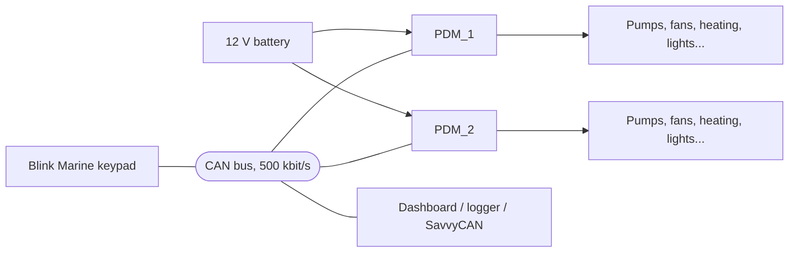

# CAN PDM –  Power Distribution Module

A CAN-controlled power distribution module (PDM) designed for a race car. It replaces fuses, relays and dashboard switches with nine protected, current-monitored high-side outputs that are switched from a Blink Marine keypad over CAN.

This repository contains everything needed to understand, build and modify the module: firmware, CAN documentation and DBC files, the Altium PCB project with thermal simulations, and the 3D models of the enclosure and bus bar.

| MCU | Supply | Outputs | CAN | Firmware |
|:---:|:---:|:---:|:---:|:---:|
| STM32F446RET6 | 12 V | 9 protected channels | 500 kbit/s | STM32 HAL |

## Table of contents

1. [What it does](#what-it-does)
2. [System overview](#system-overview)
3. [Outputs](#outputs)
4. [Protection](#protection)
5. [Keypad control](#keypad-control)
6. [CAN interface](#can-interface)
7. [Running two boards](#running-two-boards)
8. [Repository structure](#repository-structure)
9. [Hardware](#hardware)
10. [Firmware](#firmware)

---

## What it does

The PDM sits between the battery and the car's electrical loads: fuel pumps, fans, heating, cabin fans, lights and most other consumers. Each load is fed through its own Infineon PROFET smart high-side switch. The microcontroller switches the outputs, measures the current of every channel, and reacts to faults before wiring or loads are damaged.

- **Switches nine outputs** on request, from the keypad or from a CAN command frame.
- **Measures current** on every output, plus battery voltage and board temperature.
- **Detects faults** per channel: overcurrent, short circuit, open load and thermal.
- **Sheds load by priority** when the board gets too hot or the battery voltage drops: low-priority outputs go first, then medium, and everything at the critical level.
- **Gives feedback on the keypad**: each button LED shows whether its output is on or off, and blinks in a fault-specific color when the output has failed.
- **Reports everything over CAN**: status, currents and fault codes are transmitted every 100 ms for a dashboard or data logger.

## System overview



A key press is sent by the keypad to the bus. Every PDM receives it and decides, from its own key-to-output mapping, whether one of its outputs is affected. The PDM then confirms the result by updating the LED on the same key.

## Outputs

Nine outputs, grouped by current capability. Values below are the limits configured in the firmware. [The limits and thresholds in the firmware were set to arbitrary, wide-margin values, and only after several tests. They obviously need to be fine-tuned for the actual load. Next planned feature: configuring these parameters over CAN through a GUI].
| Group | Outputs | Device | Continuous limit | Startup limit (duration) | Short-circuit threshold | Open-load threshold | Priority |
|---|:---:|---|:---:|:---:|:---:|:---:|:---:|
| High | H1, H2 | BTS7002-1EPP | 21 A | 81 A (1.5 s) | 50 A | 1.0 A | High |
| High | H3 | BTS7002-1EPP | 21 A | 41 A (1.5 s) | 50 A | 0.5 A | High |
| Medium | M1, M2 | BTS7004-1EPZ | 15 A | 40 A (3.0 s) | 40 A | 0.5 A | Medium |
| Low | L1, L2 | BTS7008-2EPZ | 7.5 A | 25 A (2.5 s) | 25 A | 0.5 A | Low |
| Low | L3, L4 | BTS7008-2EPZ | 7.5 A | 15 A (2.5 s) | 15 A | 0.5 A | Low |

- Each output has its own continuous limit, a higher startup limit for a set time (loads such as lamps, motors and pumps draw a large inrush current), a short-circuit threshold and an open-load threshold.
- The BTS7008-2EPZ is a dual-channel device: **L1/L2 share one current-sense line and L3/L4 share another**.
- Load current is measured from the PROFET current-sense output: the ADC reads the voltage across a 1.2 kΩ sense resistor, `IIS = V / Rsense`, and the load current is `Iload = IIS × kILIS`, where kILIS is the device's current-sense ratio.

## Protection

### Per-channel faults

Current-based monitoring runs only while an output is on. While an output is off its current reading is ignored, so ADC noise cannot cause false faults.

| Fault | Condition | Result |
|---|---|---|
| Short circuit | Current stays above the short-circuit threshold for at least 50 ms | Output switched off, fault latched |
| Overcurrent | Current exceeds the active limit: the startup limit during the startup time, the continuous limit afterwards | Output switched off immediately, fault latched |
| Open load | Current stays below the open-load threshold for at least 200 ms, checked starting 500 ms after switch-on | Fault reported, output stays on, cleared automatically when the current rises above the threshold |
| Thermal | Thermal fault on the channel | Latched, like short circuit and overcurrent |

**Latched faults.** Short circuit, overcurrent and thermal faults are hard faults: the output cannot be switched on again until the fault is reset. Pressing the output's key on the keypad resets the fault and requests the output on. If the cause is still present, the fault is detected again and the output stays faulted until the next reset. Open load is the exception: it is not latched, and it clears by itself once the load draws current again.

Faults are shown on the keypad (blinking LED) and reported in the CAN fault messages.

### Over-temperature (board temperature)

| Level | Threshold | Action | Recovery |
|---|:---:|---|:---:|
| Warning | 70 °C | Reports the `OVERTEMP` state only | – |
| Low priority | 85 °C | Low-priority outputs switched off | 80 °C |
| Medium priority | 95 °C | Medium-priority outputs switched off | 90 °C |
| Critical | 100 °C | All outputs switched off | 95 °C |

### Under-voltage (battery voltage)

| Level | Threshold | Action | Recovery |
|---|:---:|---|:---:|
| Warning | 11.8 V | Reports the `UNDERVOLTAGE` state only | – |
| Low priority | 11.5 V | Low-priority outputs switched off | 12.0 V |
| Medium priority | 11.2 V | Medium-priority outputs switched off | 11.8 V |
| Critical | 9.5 V | All outputs switched off | 10.5 V |

Every level has a **hysteresis**: the recovery threshold is different from the shutdown threshold, so outputs do not turn on and off repeatedly around a limit.

- Outputs shed by a thermal or under-voltage shutdown come back **automatically** once the temperature or voltage passes the recovery threshold, as long as they are still requested on.
- The warning levels only change the state reported over CAN. They do not switch anything off. If both warnings are active, `OVERTEMP` takes precedence over `UNDERVOLTAGE`.
- Outputs in a latched fault (see above) are always kept off.
- Priorities are ordered High (1), Medium (2), Low (3). Each shutdown level switches off its own priority and every less important one, so **High-priority outputs are only switched off at the critical level**.

## Keypad control

The PDM works with a **Blink Marine CAN keypad**. Each button is associated with one output:

- Press a button to **toggle** its output.
- If the output is in fault, pressing the button **resets the fault** and switches the output on again.
- The LED shows the output state: green when on, off when off, and blinking yellow, amber, red or cyan for open load, overcurrent, short circuit and thermal faults.
- The LED state is re-sent every 100 ms, so the keypad recovers if a CAN frame is lost.
- Keypad brightness is set by the PDM at startup.

The key-to-output mapping is different for each board and is listed in the CAN documentation.

## CAN interface

| Parameter | Value |
|---|---|
| Bitrate | 500 kbit/s |
| Status messages | Every 100 ms |
| Byte order | Little-endian |
| Units | A, V, °C |

Transmitted messages: PDM status (heartbeat, state, total current, battery voltage, temperature), status and current of every output group, and fault codes for every output. Received messages: the output command and the keypad key frames.

The complete reference, with byte layouts and conversion formulas, is in [`FW/Doc/`](FW/Doc/). Ready-to-use DBC files for [SavvyCAN](https://www.savvycan.com/) are in [`FW/dbc database/`](FW/Dbc%20Database/).

## Running two boards

The car uses **two identical PDM boards**. They are not different hardware: `PDM_ID` in the firmware gives each board its own identity.

| | PDM_1 | PDM_2 |
|---|:---:|:---:|
| CAN address | `0x30` | `0x31` |
| Status message ID | `0x300` | `0x400` |
| Output messages | `0x301`–`0x313` | `0x401`–`0x413` |
| Command frame | `0x200` | `0x200` |

Both boards share the same bus and receive the same keypad frames; each applies its own key-to-output mapping.

## Repository structure

```
.
├── 3D/                  3D models: bus bar, cover and case
├── Docs/                Pinout of PDM_1 and PDM_2 as installed in the car
├── FW/
│   ├── Doc/             CAN message documentation
│   ├── dbc database/    DBC files for SavvyCAN (one per board)
│   └── can_pdm/         Firmware project
└── PCB/
    ├── 3d/              STEP model of the PCB
    ├── CAN_PDM/         Altium Designer project
    └── thermal analysis/ Thermal simulations
```

## Hardware

- **PCB:** designed in Altium Designer, project in `PCB/CAN_PDM/`. A STEP model of the assembled board is in `PCB/3d/`.
- **Thermal analysis:** simulations of the board under load are in `PCB/thermal analysis/`.
- **Mechanical parts:** bus bar, case and cover models are in `3D/`.
- **Pinout:** the current pinout of both boards, as installed in the car, is in `Docs/`.

## Firmware

- Microcontroller: **STM32F446RET6**
- Framework: STM32 HAL, CAN1 at 500 kbit/s
- Toolchain: **STM32CubeIDE**. Open `FW/can_pdm/` as a project, build and flash from the IDE.
- Project: `FW/can_pdm/`
- Board selection: set `PDM_ID` (`PDM_1` or `PDM_2`) in the firmware configuration before building. Each board must be flashed with its own identity.
- Protection thresholds (temperature, voltage) and per-channel current limits are defined in `pdm_config`, and can be changed there.

The firmware runs on FreeRTOS with three tasks:

| Task | Period | Job |
|---|:---:|---|
| Acquisition | 10 ms | Reads the battery voltage (ADC) and the board temperature (MCP9808 sensor), updates the current of all nine outputs and runs the fault checks |
| Telemetry | 100 ms | Transmits all CAN status, current and fault messages, and updates the keypad LEDs |
| Power manager | 100 ms | Applies the thermal and under-voltage protection, applies the requested state to every output and sets the PDM state |

PDM state reported in the CAN status message:

| State | When |
|---|---|
| `RUN` | Normal operation |
| `UNDERVOLTAGE` | Battery voltage below 11.8 V |
| `OVERTEMP` | Board temperature above 70 °C (takes precedence over `UNDERVOLTAGE`) |
| `INIT` | Initial value at power-up |
| `FAULT`, `SLEEP` | Defined in the firmware but not set by the power manager |

## License

This project is open source and released under the [MIT License](LICENSE). You are free to use, modify and share it, as long as the copyright notice is kept.

This hardware and firmware control high-current circuits in a vehicle. It is provided as is, with no warranty: build and install it at your own risk.
